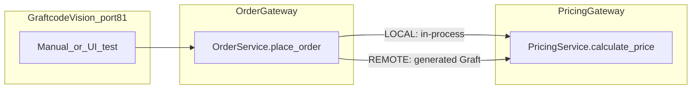
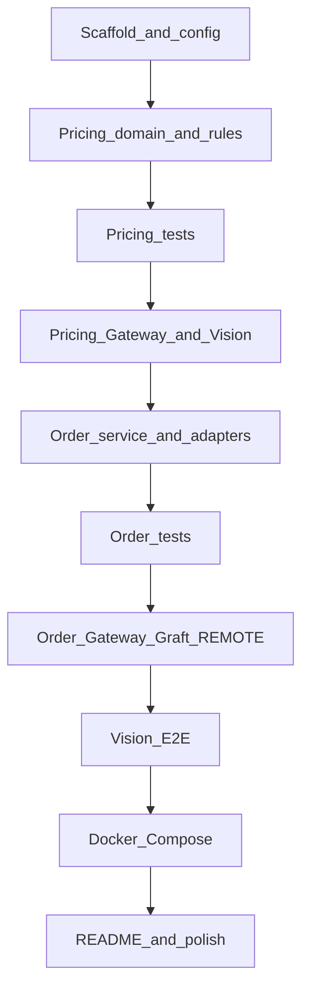

# Graftcode Recruitment Task — Step-by-Step Plan

Starting from **# Business Scenario** in [`instructions.txt`](instructions.txt). The workspace is **greenfield** (only `instructions.txt` exists). You already have a Graftcode Portal project (`mocked-yellowstone`) and `gg.exe` installed; terminal history shows a recurring **`Failed to create Binaries.zip`** when running `gg` from `C:\Program Files\Graftcode\...` (likely write-permission issue). The plan accounts for that.

## Overview

Step-by-step implementation plan for the Pricing + Order Python services from the Business Scenario onward: core domain logic first, then Graftcode Gateway/Graft/Vision wiring, LOCAL/REMOTE modes, tests, and README — starting from an empty repo with Graftcode already partially set up.

## Implementation checklist

- [x] **Scaffold** — Create project layout, pyproject/requirements, .env.example, config files (products + pricing rules)
- [x] **Pricing core** — Implement PricingService: catalog, configurable rules engine, Decimal models, domain exceptions
- [x] **Pricing tests** — Add pytest: price calc, discounts (incl. 20% cap), invalid product
- [x] **Pricing graft** — Expose Pricing via gg Gateway; verify calculate_price in Vision; install Pricing Graft
- [ ] **Order core** — Implement OrderService + PricingClient port + LOCAL/REMOTE adapters + in-memory store + error handling
- [ ] **Order tests** — Add pytest: order creation, pricing failure does not persist, validation cases
- [ ] **Order graft** — Expose Order via Gateway; wire REMOTE Graft; E2E test place_order in Vision
- [ ] **Docker & README** — Add docker-compose (optional), complete README (run, Vision, Graftcode, decisions, versioning)

---

## Target architecture



**Business flow** (from instructions):

1. Receive order request → 2. Validate product/quantity → 3. Calculate price/discount/total → 4. Create order result → 5. Expose via Vision for testing

---

## Phase 0 — Prerequisites (before coding)

**Status: completed** — see [docs/PHASE0.md](docs/PHASE0.md). Run `.\scripts\verify-phase0.ps1` to re-check.

| Step | Action |
|------|--------|
| 0.1 | Confirm Python 3.11+ and a virtualenv per service or one repo-level venv |
| 0.2 | Portal: workspace exists, **ProjectKey** saved (you have one for `mocked-yellowstone`) |
| 0.3 | Install Graftcode Gateway if not already; **do not run `gg` from `Program Files`** — copy/symlink `gg.exe` into the project or run from a writable working directory to avoid `Binaries.zip` errors; try `--doNotExtractBinaries` only if docs require it |
| 0.4 | Skim [Graftcode Quick Start](https://academy.graftcode.com/quick-start) tutorials **#2 Expose a Backend Service** and **#3 Connect Microservices** (Python track), plus [monolith ↔ microservices switch](https://academy.graftcode.com/quick-start/switch-between-monolith-and-microservices/javascript) for the `GRAFT_CONFIG` pattern |

---

## Phase 1 — Project scaffold

**Status: completed** — see [README.md](README.md). Run `pytest` to verify config loading.

Create a small, reviewable layout (example — adjust names to taste):

```
graftcode-recruitment-task/
├── pricing_service/
│   ├── service.py          # public PricingService.calculate_price
│   ├── models.py           # PricingResult, Product
│   ├── catalog.py          # product lookup
│   ├── rules.py            # discount rule engine
│   └── exceptions.py
├── order_service/
│   ├── service.py          # public OrderService.place_order
│   ├── models.py           # OrderResult
│   ├── pricing_port.py     # Protocol: calculate_price(...)
│   ├── pricing_local.py    # in-process adapter
│   ├── pricing_remote.py   # Graft adapter
│   ├── store.py            # in-memory orders
│   └── exceptions.py
├── config/
│   ├── products.json
│   └── pricing_rules.json
├── tests/
├── docker-compose.yml      # bonus but recommended
├── pyproject.toml            # or requirements.txt
├── .env.example
└── README.md
```

| Step | Action |
|------|--------|
| 1.1 | Add `pyproject.toml` / `requirements.txt` with `pytest`, and any Graftcode Python SDK deps from academy docs |
| 1.2 | Add `.env.example` with `PRICING_MODE=LOCAL\|REMOTE`, `PROJECT_KEY`, `GRAFT_CONFIG`, gateway host/ports |
| 1.3 | Add `.gitignore` for venv, `__pycache__`, generated graft packages, `.env` |

---

## Phase 2 — Domain decisions (document in README early)

**Status: completed** — see [README.md § Domain decisions](README.md#domain-decisions) and [docs/PHASE2.md](docs/PHASE2.md).

Lock these before heavy coding; interviewers care about reasoning:

| Topic | Recommended choice |
|-------|-------------------|
| Money | `decimal.Decimal` for all calculations; serialize as string/float only at boundaries |
| Discount stacking | Sum customer % + quantity %, **cap at 20%** total (per instructions) |
| Rounding | Round `total_price` to 2 decimal places with `ROUND_HALF_UP` |
| Quantity `0` or negative | Reject with validation error (400-style domain error) |
| Unknown product | Validation error, not infrastructure error |
| Unsupported `customer_type` | Validation error |
| Discount combine example | `premium` + qty≥10 → 10% + 5% = 15% (under cap) |

---

## Phase 3 — Pricing Service (core logic)

**Status: completed** — run `pytest tests/test_pricing.py`. See [docs/PHASE3.md](docs/PHASE3.md).

### 3.1 Models (`pricing_service/models.py`)

- `Product(id, name, unit_price: Decimal)`
- `PricingResult(product_id, unit_price, quantity, discount_percent, total_price)` — use dataclasses or Pydantic; keep fields graft-friendly (simple types)

### 3.2 Catalog (`pricing_service/catalog.py`)

- Load products from `config/products.json` (laptop/mouse/keyboard from instructions)
- `get_product(product_id) -> Product | None`
- Validate malformed config at startup

### 3.3 Configurable rules (`pricing_service/rules.py`)

**Do not hardcode rules inside `calculate_price`.** Use one of:

- YAML/JSON rule list + small evaluator, **or**
- Strategy/rule classes registered in a list

Example rule config shape:

```json
{
  "customer_discounts": { "regular": 0, "premium": 10 },
  "quantity_discounts": [{ "min_quantity": 10, "percent": 5 }],
  "max_total_discount_percent": 20
}
```

Engine steps:

1. Resolve customer discount %
2. Add quantity discount % if applicable
3. `effective_discount = min(sum, max_total_discount_percent)`
4. `total = unit_price * quantity * (1 - effective_discount/100)`

### 3.4 Service API (`pricing_service/service.py`)

```python
class PricingService:
    def calculate_price(self, product_id: str, quantity: int, customer_type: str) -> PricingResult:
        ...
```

- Validate product exists, quantity > 0, supported `customer_type`
- Raise domain exceptions (`UnknownProductError`, `InvalidQuantityError`, etc.) — clear, typed errors for Order Service to map

### 3.5 Pricing tests (`tests/test_pricing.py`)

Minimum from instructions:

- Base price calculation
- Discount scenarios (`regular`, `premium`, qty≥10, combined + cap)
- Invalid product

---

## Phase 4 — Expose Pricing via Graftcode Gateway

**Status: completed** — see [docs/PHASE4.md](docs/PHASE4.md). Run `.\scripts\start-pricing-gateway.ps1` then open Vision.

| Step | Action |
|------|--------|
| 4.1 | Ensure `PricingService` methods are **public** on a class/module Gateway can discover |
| 4.2 | Run Gateway from **project directory** (writable): `gg --projectKey <KEY> --runtime python --modules <path-to-pricing-module>` — use non-privileged ports if 80/81 are taken (e.g. `--port 9080 --httpPort 9081`) |
| 4.3 | Open **Graftcode Vision** (default `http://localhost:81` or your `httpPort`) — confirm `calculate_price` appears |
| 4.4 | Copy the **pip install** command for the generated Pricing Graft; install into Order Service venv |
| 4.5 | Smoke-test graft call in a small script before wiring Order Service |

**Critical constraint:** Order → Pricing in REMOTE mode must use the **generated Graft**, not hand-written REST/gRPC.

---

## Phase 5 — Order Service (core logic)

### 5.1 Pricing port abstraction (`order_service/pricing_port.py`)

```python
class PricingClient(Protocol):
    def calculate_price(self, product_id: str, quantity: int, customer_type: str) -> PricingResult: ...
```

Keeps `OrderService` stable across LOCAL/REMOTE.

### 5.2 LOCAL adapter (`order_service/pricing_local.py`)

- Instantiate/import `PricingService` in-process
- Delegate `calculate_price` — simulates modular monolith

### 5.3 REMOTE adapter (`order_service/pricing_remote.py`)

- Use generated Graft client (pattern from academy: `GraftConfig.setConfig(os.environ["GRAFT_CONFIG"])` then call remote class method like local code)
- Map graft/network failures to infrastructure errors

### 5.4 Order service (`order_service/service.py`)

```python
class OrderService:
    def place_order(self, product_id: str, quantity: int, customer_type: str) -> OrderResult:
```

Flow:

1. Call `pricing_client.calculate_price(...)` — **no duplicated pricing math**
2. On success: generate `order_id` (e.g. `uuid4()`), persist to in-memory store, return `OrderResult` with `status="created"`
3. On pricing validation error: propagate clear message, **do not save order**
4. On infrastructure error: log, return/readable error, **do not save order**

### 5.5 Mode selection (config only)

- Read `PRICING_MODE` or `GRAFT_CONFIG` presence from env
- Factory: `build_pricing_client()` returns Local or Remote — **no business-logic `if` in `place_order`**

### 5.6 Partial failure handling

| Case | Behavior |
|------|----------|
| Validation errors from Pricing | Pass through as client errors |
| Timeout / gateway down | Log structured error; optional retry (1–2 attempts with backoff) — bonus |
| After failure | No order persisted |

Use `logging` with `order_id`, `product_id`, mode, and error type.

### 5.7 Order tests (`tests/test_order.py`)

- Happy path with **mock/fake** `PricingClient` (unit test, no Gateway)
- Pricing failure → no order saved
- Optional integration test with LOCAL mode end-to-end

---

## Phase 6 — Expose Order via Graftcode + Vision testing

| Step | Action |
|------|--------|
| 6.1 | Run second Gateway instance (or separate compose service) hosting `OrderService.place_order` on different ports if Pricing Gateway still running |
| 6.2 | Confirm `place_order` in Vision |
| 6.3 | Test full flow in Vision: valid order, unknown product, bad quantity |
| 6.4 | Document Vision URL and example inputs in README |

This satisfies: *"expose the order operation so it can be tested"* and *"tested through Graftcode Vision"*.

---

## Phase 7 — Docker Compose (recommended bonus)

`docker-compose.yml` with three services:

| Service | Role |
|---------|------|
| `pricing-gateway` | Python + `gg` hosting pricing module |
| `order-gateway` | Python + `gg` hosting order module; env `GRAFT_CONFIG` pointing at pricing WebSocket |
| Optional `pricing-app` / `order-app` | Only if you split runtime from gateway |

- Mount source code as volumes for dev
- Map ports explicitly (avoid 80 conflicts on Windows)
- Pass `PROJECT_KEY` via env file (never commit real key)

---

## Phase 8 — README (required sections)

`README.md` must include:

1. **How to run** — venv, env vars, start gateways, LOCAL vs REMOTE switch
2. **Where ProjectKey goes** — env var / CLI flag / compose
3. **Graftcode usage** — Gateway → Graft install → local-like call; why not REST between services
4. **Vision testing** — URL, which service/method to invoke, sample payloads
5. **Technical decisions** — Decimal, discount stacking, rounding, edge cases
6. **Configurable rules** — file format and how to add a rule without rewriting engine
7. **Versioning strategy** (brief, no full impl) — additive fields, avoid breaking signatures, deprecate old graft versions
8. **Monolith → microservices evolution** — same `place_order` code, swap `GRAFT_CONFIG` / `PRICING_MODE` only

---

## Phase 9 — Final verification checklist

Before submission, confirm:

- [ ] `calculate_price` works standalone (tests pass)
- [ ] `place_order` never duplicates pricing rules
- [ ] REMOTE mode calls Pricing **only** via generated Graft
- [ ] LOCAL mode works without Gateway running
- [ ] Switching modes requires **config/env change only**
- [ ] Vision can invoke `place_order` end-to-end
- [ ] Invalid product / quantity / customer type / pricing outage handled per spec
- [ ] No secrets in git
- [ ] You can explain the solution live (walkthrough, trade-offs, small change)

---

## Suggested implementation order (single timeline)



**Timeboxing tip:** Get Pricing + LOCAL Order working first (proves domain logic), then add Graftcode (highest risk due to alpha tooling), then REMOTE mode and Compose.

---

## Known risk: Gateway error

From terminal history: `Failed to create Binaries.zip at C:/Program Files/Graftcode/GraftcodeGateway/bin/`. Mitigations to try during Phase 4:

1. `cd` to project folder; run `gg` from there with full `--modules` path
2. Run terminal as Administrator **or** install Gateway to a user-writable path
3. Pre-create a writable `bin` folder and run `gg` with cwd there
4. Contact Graftcode support if error persists (acceptable per instructions)

Do not implement Order→Pricing via REST as a workaround — that violates the core evaluation criterion.
